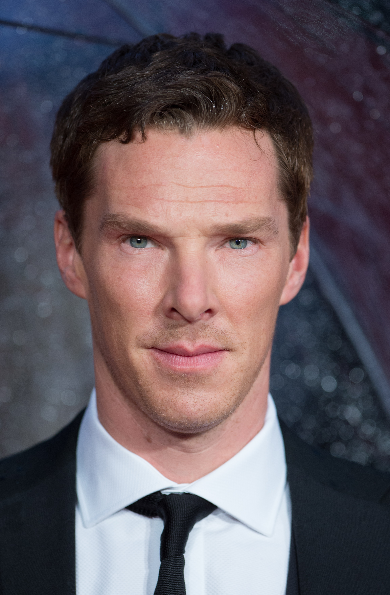
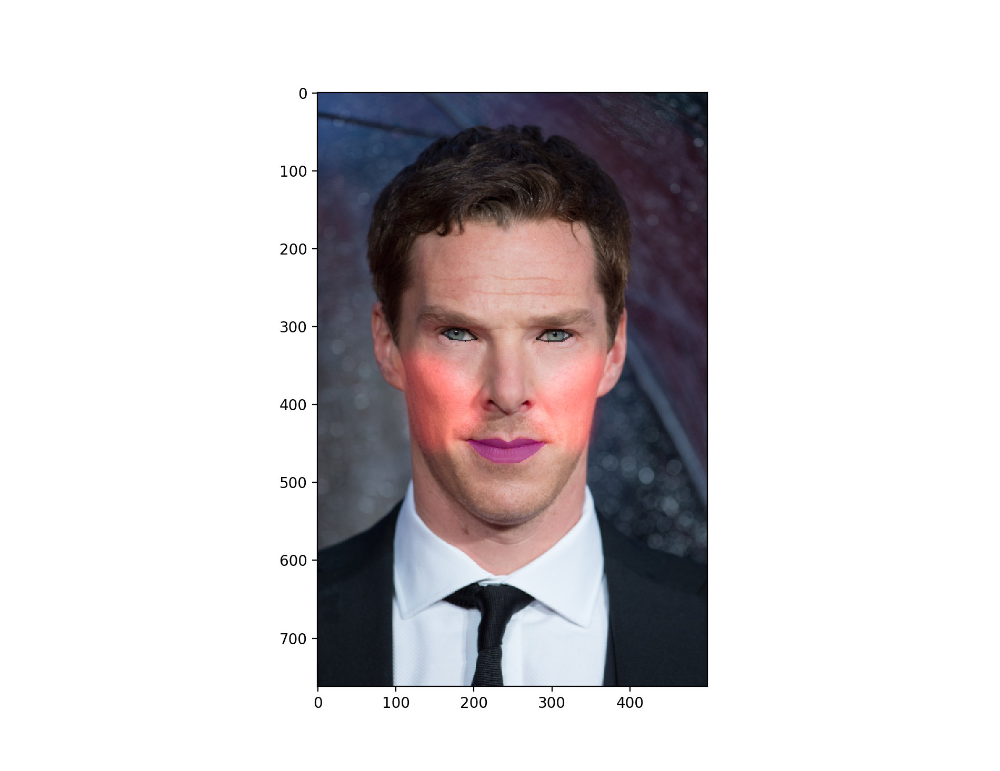

# Applying-Face-Makeup

This code applies facial makeup on images of celebrities. It fetches images stored in google drive using Google API and does processing on it to give the final output. Following are the steps to replicate it.

### Setting up environment  
* Make a conda virtual environment first and connect it to the attached jupyter notebook. Follow [this](https://janakiev.com/blog/jupyter-virtual-envs/) link for more help  
* The submitted program uses dlib library. ‘cmake’ is a prerequisite to install dlib  
* Install cmake first: `conda install -c anaconda cmake`  
* Install dlib using: `conda install -c menpo dlib`  
* Then install all the other requirements given in the requirements file attached `pip -r install --upgrade requirements`  
* When the jupyter notebook is opened, connect it to the new environment that was just made  

### Use of Google API  
**NOTE:** For security reasons I have removed my credentials.json file. You will have to refer the guide on Google.
* Follow [this](https://developers.google.com/drive/api/v3/quickstart/python) link for getting started  
* When you click the button, ‘Enable the Drive API’, a new flash window would appear, download the client configuration through that window  
* The credentials.json file downloaded must be in same folder as that of the jupyter notebook  
* The rest should follow  

3. Using dlib for Face Recognition
* Refer [this](https://www.pyimagesearch.com/2017/04/03/facial-landmarks-dlib-opencv-python/) blog for more information on how to do face recognition
* Download the necessary files mentioned in the link above in order to detect landmarks points on face

### Applying makeup
* Once you complete above steps, the rest should follow as per the code written in `makeup.ipynb`
* Following is the transformation you would get to see in images  
**Input Image**:  

   
**Output Image**:  

